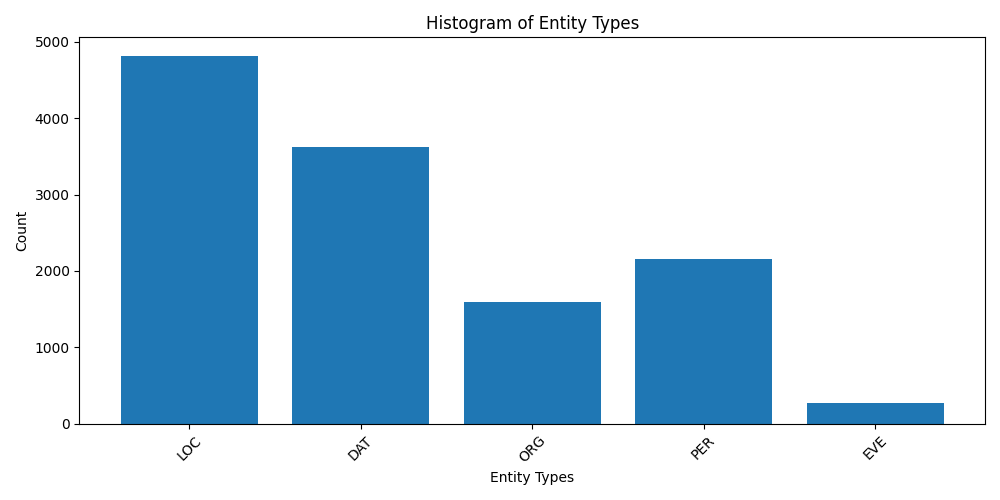

    <em>A Large-Scale Open Persian Speech Dataset</em>

# Neyshekar

Neyshekar is an open, community-driven **Persian speech dataset** collected via a web-based crowdsourcing platform at **[https://ney.shekar.io](https://ney.shekar.io)**. It is designed to support research and development in **text-to-speech (TTS)**, **automatic speech recognition (ASR)**, **speech representation learning**, and other downstream **Persian speech applications**.

The recordings are provided by a combination of **volunteer contributors and paid voice actors**, all of whom are native Persian speakers. Each release represents a **stable snapshot** of the dataset, enabling **reproducible research** and **consistent benchmarking**.

## Dataset Releases

Neyshekar is released incrementally. Each release represents a stable snapshot of the dataset at the time of publication.

### V5.0 — 2026-07-16 ([download](https://doi.org/10.5281/zenodo.18073632))

- Total samples: **50,026** (**f**: 26,826, **m**: 22,655)
- Informal samples: **17,491** (34.96%) (identified using Shekar rule-based InformalClassifier)
- Total duration (hours): **79.22**
- Average clip duration (seconds): **5.7**
- Total tokens: **565,797**
- Vocab size: **27,250**

### V4.1 — 2026-06-15

- Total samples: **40,008** (**f**: 21,613, **m**: 17,845)
- Informal samples: **13,946** (34.86%) (identified using Shekar rule-based InformalClassifier)
- Total duration (hours): **63.03**
- Average clip duration (seconds): **5.67**
- Total tokens: **456,268**
- Vocab size: **26,758**
- Entities: **12,443** (identified using Shekar NER)

Entity type counts:
LOC: 4817, 
DAT: 3616, 
ORG: 1588, 
PER: 2156, 
EVE: 266,

> [!CAUTION]
> **Sample mismatches in v4.** A number of clips in the **v4** release (2026-05-14)
> have misaligned audio–transcript pairs. Training or evaluating on this snapshot
> may introduce label noise and lead to unreliable results. If you have already downloaded v4, discard it and re-download v4.1.

### v3 — 2026-03-23

- Total samples: 30019
- Total duration (hours): 45.71
- Average clip duration (seconds): 5.48
- Total tokens: 331714
- Vocab size: 23972

### v2 — 2026-01-15

- Total samples: 20,020
- Total duration (hours): 29.08
- Average clip duration (seconds): 5.23
- Total tokens: 208,472
- Vocab size: 20,853

### v1 — 2025-12-29

- Total samples: 10,044  
- Total duration: 14.42 hours  
- Average clip duration: 5.17 seconds  
- Total tokens: 103,757  
- Vocabulary size: 15,224

## Terms of Use
 
Any attempt to identify or uncover the identity of speakers in the Neyshekar datasets is strictly prohibited.

## License

This dataset is released under the **CC0 1.0 Universal** license.  
It may be used, modified, and redistributed for any purpose without restriction.

##

<em>With ❤️ for <strong>IRAN</strong></em>

